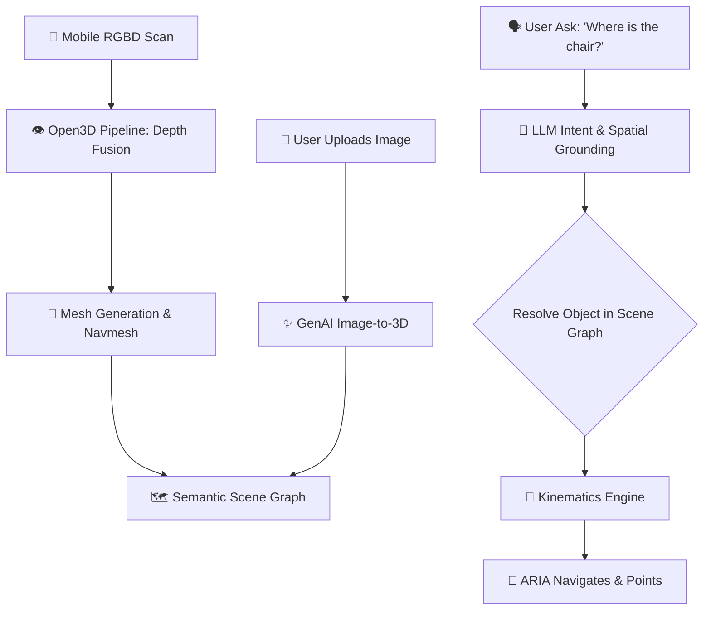
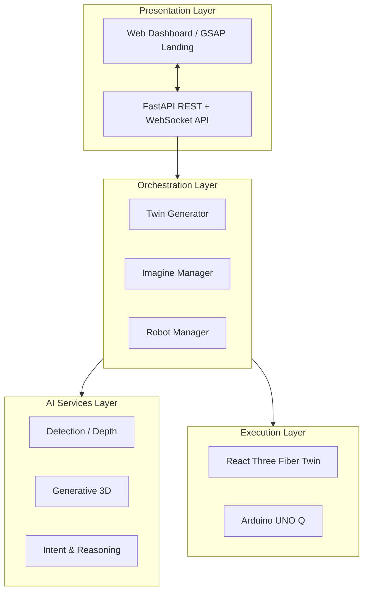

<div align="center">


<br/>

<a href="https://github.com/TIRTHPATEL3086/Roomind" target="_blank">
  
</a>

<br/>

[](https://reactjs.org/)
[](https://python.org/)
[](https://pytorch.org/)
[](https://www.arduino.cc/)

<br/>


<br/>

> **🚀 "Bridging the gap between physical reality and digital AI through Semantic Scene Graphs and Embodied Robotics."**

[🌐 **LIVE DEMO**](#) &nbsp;•&nbsp; [📑 **ARCHITECTURE**](#-system-architecture)

</div>

---

<br/>

<div align="center">
  
</div>

<br/>

Traditional smart home platforms are 2D dashboards blind to spatial reality. **RoomMind** completely reimagines environmental interaction with a **Semantic 3D Digital Twin** and an **Embodied AI Companion (ARIA)**:

- **🤖 Embodied Grounding (ARIA):** A humanoid AI that lives inside your digitized room. She knows where everything is, answers questions grounded in the actual room, turns her head to look, and physically drives over to point at objects.
- **📸 Generative Image-to-3D:** Hand ARIA an image (e.g., "a wooden chair") and she builds it in 3D, sizes it correctly, and places it in your room—immediately navigating to it as if it were physically scanned.
- **🗺️ Monocular & RGBD Reconstruction:** Scan your room with a phone; the system reconstructs a textured 3D environment complete with a fully navigable semantic scene graph.
- **⚡ Ultra-Low Latency Robotics:** Real-time 10Hz MQTT telemetry syncing a React Three Fiber rigged twin with physical Arduino hardware, including a 2ms emergency stop (E-stop).
- **🎬 GSAP Cinematic Layer:** Seamless, high-performance visual storytelling with code-split `<Canvas>` mounting for zero-flash handoffs.

<br/>

---

<div align="center">
  
</div>

<br/>

<div align="center">

### 🟢 3D Cinematic Intro & Dashboard
| 🎥 **GSAP Cinematic Landing** | 🖥️ **Live Room Dashboard** |
| :---: | :---: |
|  |  |
| *6-beat camera flight into the room, 60fps performance* | *Live WebGL twin, clickable semantics, robot controls* |

<br/>

### 🟢 Embodied AI & Generation
| 🤖 **ARIA Grounded Interaction** | 🪑 **Image-to-3D Generation** |
| :---: | :---: |
|  |  |
| *"Where is the lamp?" — Turns head, calculates path, points.* | *Upload 2D image → 3D mesh placed in semantic graph.* |

</div>

<br/>

---

<div align="center">
  
</div>

<br/>

<div align="center">
  
</div>

<br/>

<details>
<summary><b>Click to expand detailed tech-stack breakdown</b></summary>
<br/>

| Domain | Technology / Library | Role & Justification |
| :--- | :--- | :--- |
| **Frontend UI/3D** | `React 18`, `Three.js`, `R3F`, `GSAP` | Zero-flash component handoff, cinematic scrolling, fast 3D. |
| **Backend API** | `Python 3.11`, `FastAPI`, `Uvicorn` | Strict type safety, high performance async I/O. |
| **Reconstruction** | `Open3D`, `OpenCV`, `SciPy` | RGBD depth fusion, point cloud meshing, and navmesh. |
| **Generative AI** | `PyTorch`, LLM Services | Intent parsing, spatial reasoning, text/image to 3D. |
| **IoT / Hardware** | `MQTT (amqtt)`, `Arduino UNO Q` | 10Hz telemetry stream, bi-directional kinematics. |
| **Data & State** | `PostgreSQL 16`, `Prisma/Alembic` | Strict contract-driven schema validation (scene graph). |

</details>

<br/>

---

<div align="center">
  
</div>

<br/>

RoomMind integrates multiple isolated Python environments to prevent dependency clashes (e.g., keeping PyTorch out of the API process) and uses strict JSON schema boundaries.



<br/>

---

<div align="center">
  
</div>

<br/>

Four layers, downward calls only. Results travel back up as events, never as blocking return values across a layer boundary. Strict type contracts govern every interface.



<br/>

---

<div align="center">
  
</div>

<br/>

> **Note:** Requires **Python 3.11** specifically (for Open3D wheels) and PostgreSQL 16.

### 1️⃣ Setup Environments & Contracts
```powershell
# 1. Generate Contracts
py -3.11 contracts\generate_types.py
py -3.11 scripts\check_contracts.py

# 2. Setup API Backend
py -3.11 -m venv backend\.venv
backend\.venv\Scripts\python -m pip install -r backend\requirements.txt

# 3. Setup AI Services (Isolated Venvs)
py -3.11 -m venv genai3d\.venv
genai3d\.venv\Scripts\python -m pip install pillow numpy trimesh pygltflib pytest
py -3.11 -m venv reconstruction\.venv
reconstruction\.venv\Scripts\python -m pip install opencv-python-headless open3d numpy scipy trimesh pygltflib pillow pytest ultralytics --extra-index-url https://download.pytorch.org/whl/cpu
```

### 2️⃣ Launch System Components (Separate Terminals)
```powershell
# Terminal 1: MQTT Broker
py -3.11 -m venv .broker-venv
.broker-venv\Scripts\python -m pip install amqtt
.broker-venv\Scripts\amqtt.exe -c infra\amqtt\broker.yaml

# Terminal 2: FastAPI Backend
cd backend; .venv\Scripts\uvicorn.exe main:app --port 8000

# Terminal 3: Robot Simulator
backend\.venv\Scripts\python.exe firmware\sim\robot_sim.py

# Terminal 4: Frontend
cd frontend; npm install; npm run dev
# Visit http://localhost:5173
```

### 3️⃣ Interact via API (Try It!)
```powershell
# Ask ARIA about the room
curl -X POST localhost:8000/api/v1/chat -H "Content-Type: application/json" -d "{\"message\":\"how many chairs are there?\"}"

# Ask ARIA to point at something
curl -X POST localhost:8000/api/v1/chat -H "Content-Type: application/json" -d "{\"message\":\"where is the lamp?\"}"

# Emergency Stop
curl -X POST localhost:8000/api/v1/estop
```

<br/>

---

<div align="center">


*RoomMind — Breaking the boundaries between physical space and digital intelligence.* 🌌

</div>
