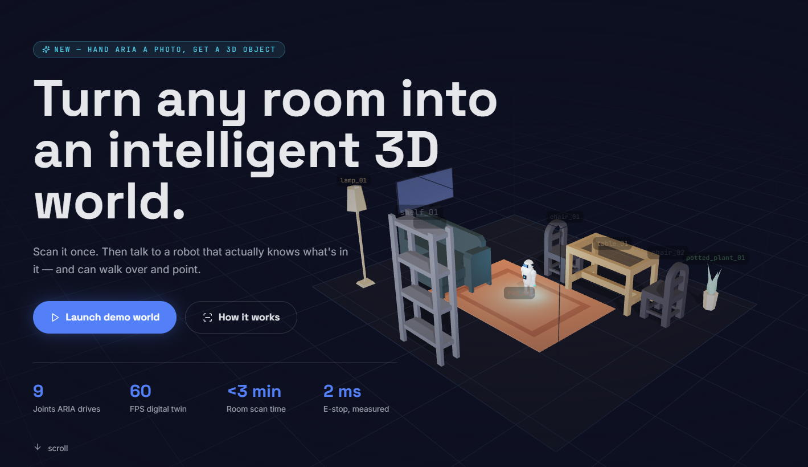
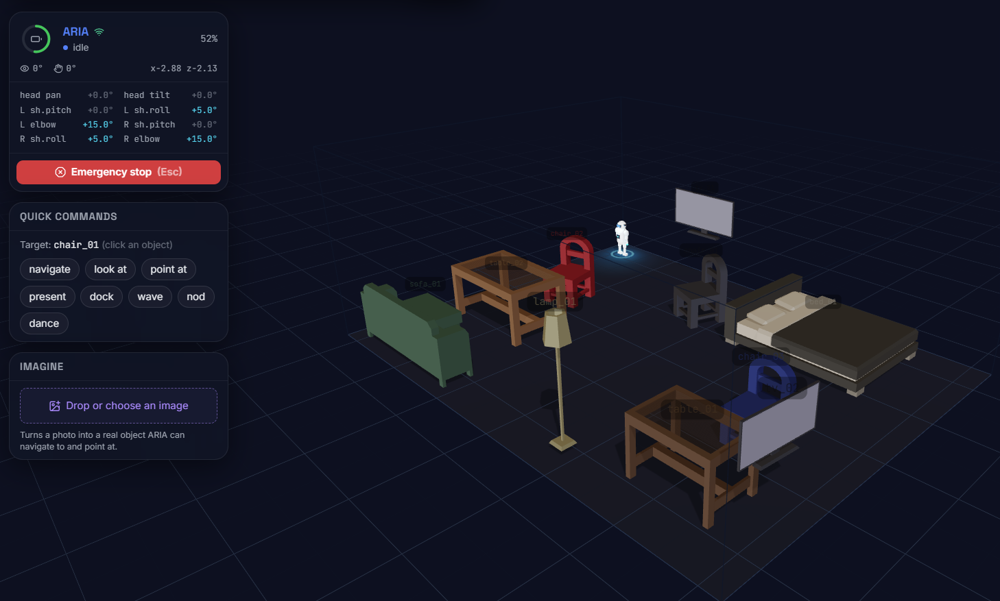
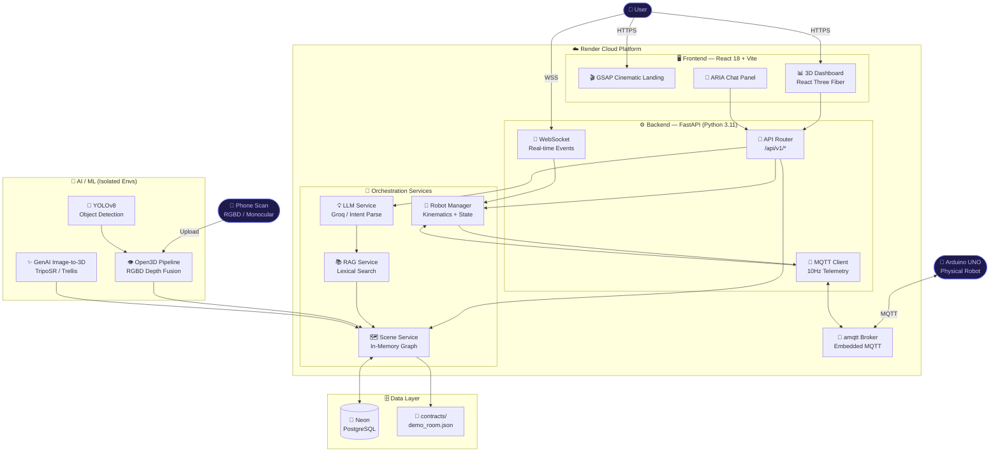
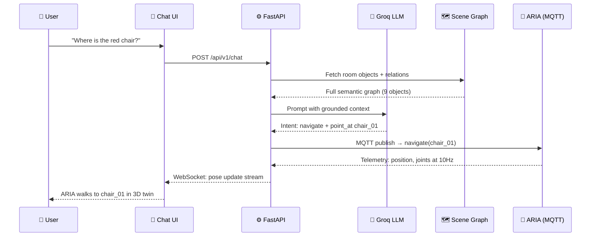

<div align="center">


<br/>

<a href="https://roommind-cpib.onrender.com" target="_blank">
  
</a>

<br/>

[](https://roommind-cpib.onrender.com)
[](https://youtu.be/e9zUi_VcGUE)

<br/>

[](https://reactjs.org/)
[](https://threejs.org/)
[](https://fastapi.tiangolo.com/)
[](https://python.org/)
[](https://neon.tech/)
[](https://render.com/)
[](https://docker.com/)
[](https://www.arduino.cc/)

<br/>


</div>

---

## ✨ What is RoomMind?

**RoomMind** transforms any physical room into an intelligent, interactive **3D Digital Twin** powered by an **Embodied AI Companion — ARIA**. Unlike traditional smart home apps that show you a 2D floor plan, RoomMind builds a full semantic 3D world from a simple phone scan, then lets you talk to a robot that *actually knows where everything is* and can physically walk over and point at it.

> **"Scan it once. Then talk to a robot that actually knows what's in it — and can walk over and point."**

---

## 🖥️ Live Application

<div align="center">

### 🌟 Cinematic Landing Page



*GSAP-powered landing — 60fps 3D room preview, live stats: 9 joints · 60 FPS · &lt;3 min scan · 2ms E-stop*

<br/>

### 🤖 Live 3D Dashboard — ARIA in Action


*ARIA navigating to `chair_01` — real-time joint telemetry HUD, semantic object labels, Quick Commands panel*

</div>

---

## 🏆 Key Capabilities

| Feature | Description |
|:---|:---|
| **🤖 Embodied ARIA** | Humanoid AI that lives in your 3D room. She navigates to objects, turns her head, waves, dances, and answers spatial questions. |
| **📸 Generative Image-to-3D** | Upload a photo of any object → ARIA builds it in 3D, correctly sizes it, and places it in the room instantly. |
| **🗺️ Semantic Scene Graph** | Every object has a full semantic record: position, dimensions, colour, surface height, obstacle status, and spatial relations. |
| **⚡ 2ms E-Stop** | Hardware emergency stop with sub-millisecond in-app latency, verified by the `X-Server-Time-Ms` middleware. |
| **📡 10Hz MQTT Telemetry** | Real-time bidirectional sync between the React Three Fiber twin and physical Arduino hardware. |
| **🧠 LLM Spatial Reasoning** | Groq-powered intent parsing with full scene-graph grounding — ARIA answers "where is the red chair near the table" correctly. |
| **🎬 GSAP Cinematic Layer** | 6-beat camera flight intro, code-split `<Canvas>` mounting for zero-flash route handoffs. |

---

## 🗺️ System Architecture



---

## 🧠 AI Conversation Flow



---

## 🏗️ Monorepo Layout

```
roommind/
├── 🖥️  frontend/          # React 18 + Vite + Three.js SPA
│   ├── src/
│   │   ├── components/    # Dashboard, Chat, Imagine, HUD panels
│   │   ├── three/         # SceneRoot, RobotAvatar, CameraRig, R3F
│   │   ├── motion/        # GSAP cinematic layer, smooth scroll
│   │   ├── store/         # Zustand: scene, robot, chat, UI state
│   │   └── api/           # REST client + WebSocket hooks
│   └── public/models/     # 100+ Kenney GLB furniture models
│
├── ⚙️  backend/           # FastAPI + Uvicorn (Python 3.11)
│   ├── app/
│   │   ├── api/v1/        # REST: rooms, chat, robot, imagine, health
│   │   ├── services/      # Scene, Robot, LLM, RAG, MQTT services
│   │   ├── db/            # SQLAlchemy models + Alembic migrations
│   │   └── core/          # Event bus, enrich, errors
│   └── alembic/           # DB migrations (10 tables)
│
├── 📄  contracts/          # JSON scene graph schemas + demo fixtures
│   ├── demo_room.json      # Primary living room demo
│   ├── demo_room_bedroom.json
│   ├── demo_room_office.json
│   └── scene_graph.schema.json
│
├── 🔬  reconstruction/    # Open3D RGBD pipeline (isolated venv)
├── ✨  genai3d/           # Image-to-3D pipeline (isolated venv)
├── 🤖  firmware/          # Arduino UNO firmware + ARIA simulator
├── 📡  infra/amqtt/       # Embedded MQTT broker config
├── 🐳  Dockerfile         # Multi-stage: Node build → Python serve
└── 📦  render.yaml        # Render Blueprint deployment
```

---

## 🛠️ Technology Stack

<div align="center">

</div>

<br/>

| Layer | Technology | Purpose |
|:---|:---|:---|
| **Frontend** | `React 18`, `Three.js`, `React Three Fiber`, `GSAP` | 3D twin, cinematic landing, zero-flash route handoffs |
| **Backend** | `Python 3.11`, `FastAPI`, `Uvicorn`, `WebSocket` | Async REST + real-time event streaming |
| **AI / LLM** | `Groq API`, `LLM Intent Parsing`, `Lexical RAG` | Spatial question answering, grounded command dispatch |
| **Computer Vision** | `Open3D`, `OpenCV`, `YOLOv8`, `MiDaS` | RGBD fusion, object detection, monocular depth |
| **Generative 3D** | `TripoSR`, `Trellis`, `PyTorch` | Image → 3D mesh → auto-placed in scene |
| **Database** | `Neon PostgreSQL`, `SQLAlchemy`, `Alembic` | Persistent scene graph, robot state, chat history |
| **IoT / Hardware** | `MQTT (amqtt)`, `Arduino UNO`, `paho-mqtt` | 10Hz bidirectional telemetry stream |
| **Infrastructure** | `Docker`, `Render`, `GitHub Actions` | Multi-stage build, cloud deployment |

---
<div align="center">


*RoomMind — Breaking the boundaries between physical space and digital intelligence.* 🌌

</div>
